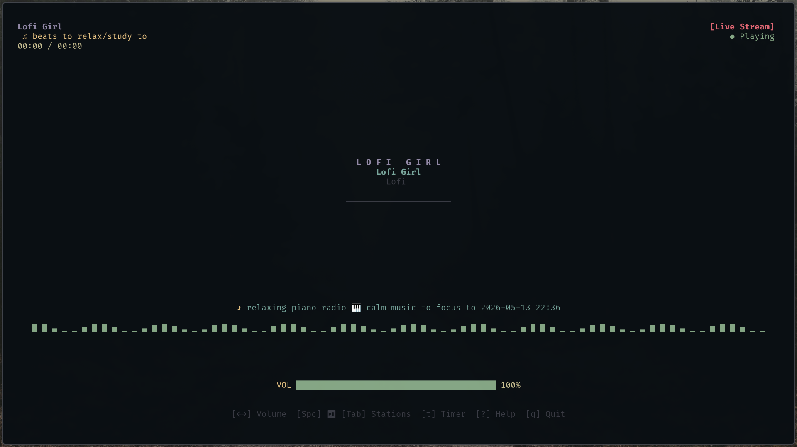

<div align="center">

# 🎧 Lofi Girl CLI 🎧

A beautiful, minimal, and fast terminal user interface (TUI) to stream Lofi Girl music directly from your terminal. Built with Rust 🦀 and Ratatui.

</div>

## 📸 Preview



## ✨ Features

* **Live Streaming:** Stream Lofi Girl live radio right in your terminal.
* **Multiple Stations:** Switch between relaxing beats, synthwave, and other stations seamlessly.
* **Audio Visualizer:** Enjoy a real-time reactive spectrum visualizer that grooves to the music.
* **Built-in Timer:** Set focus timers directly within the app—perfect for studying and the Pomodoro technique!
* **Global Controls:** Easy-to-use keyboard shortcuts for volume and playback control.
* **Highly Performant:** Built in Rust utilizing `tokio` for async operations and `ratatui` for lightweight UI rendering.

## 🚀 Installation

### Prerequisites
Make sure you have Rust and Cargo installed. If not, install them from [rustup.rs](https://rustup.rs/).

```bash
curl --proto '=https' --tlsv1.2 -sSf https://sh.rustup.rs | sh
```

You might also need multimedia dependencies like `mpv` or `vlc` depending on your backend player implementation (make sure the relevant player is accessible in your `$PATH`).

### Build from source
1. Clone the repository:
```bash
git clone https://github.com/Divyanshu-kumar14/LofiGirl-CLI.git
cd LofiGirl-CLI
```

2. Build for optimal performance:
```bash
cargo build --release
```

3. Run the application:
```bash
cargo run --release
```

*(You can also move the executable located in `target/release/LofiGirl-CLI` to your `/usr/local/bin` to run it globally).*

## 🎮 Keybindings

| Key | Action |
| :---: | :--- |
| `[Space]` | Play/Pause the stream |
| `[Tab]` | Open Stations menu to switch streams |
| `[←] / [→]` | Decrease / Increase Volume |
| `[t]` | Open the Focus Timer menu |
| `[?]` | Toggle Help Menu |
| `[q]` | Quit the application |

## 🛠️ Built With

* [Rust](https://www.rust-lang.org/) - Systems programming language
* [Ratatui](https://github.com/ratatui-org/ratatui) - A Rust library to build terminal user interfaces
* [Tokio](https://tokio.rs/) - An asynchronous runtime for Rust
* [Crossterm](https://github.com/crossterm-rs/crossterm) - Cross-platform terminal manipulation

## 🤝 Contributing

Contributions, issues, and feature requests are welcome!
Feel free to check out the [issues page](https://github.com/Divyanshu-kumar14/LofiGirl-CLI/issues) if you want to contribute.

1. Fork the Project
2. Create your Feature Branch (`git checkout -b feature/AmazingFeature`)
3. Commit your Changes (`git commit -m 'Add some AmazingFeature'`)
4. Push to the Branch (`git push origin feature/AmazingFeature`)
5. Open a Pull Request

## 📝 License

This project is open-source and distributed under the terms of the license included in the repository. See `LICENSE` for more information.

---
_Disclaimer: This project is an unofficial open-source client and is not affiliated with, maintained, authorized, endorsed, or sponsored by Lofi Girl or any of its affiliates._
